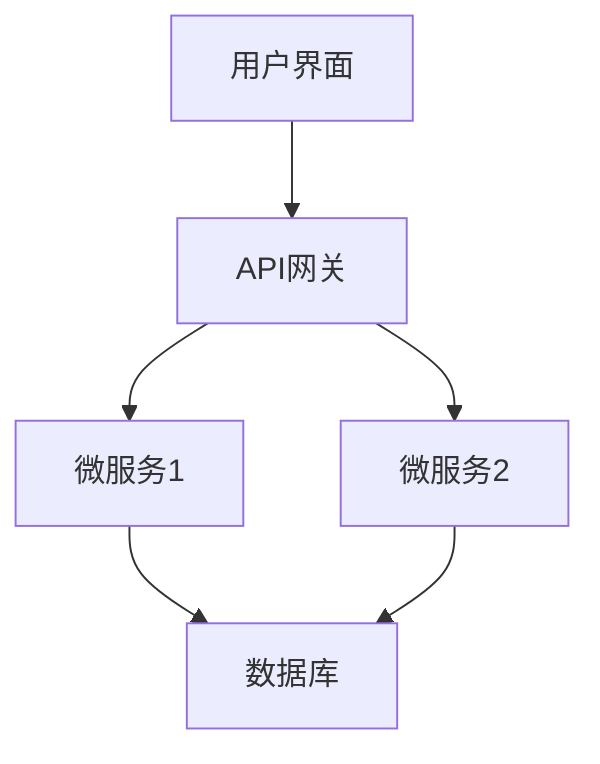
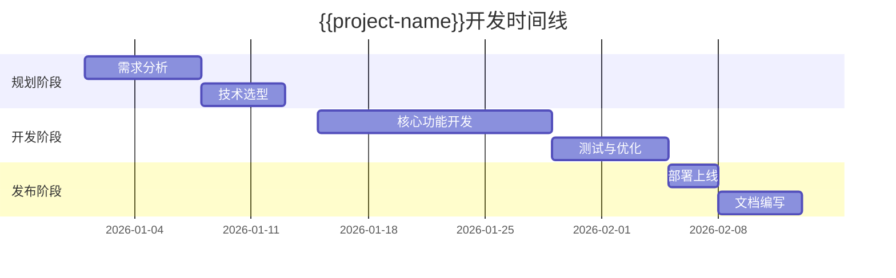

# {{project-name}}

## 项目概述

{{project-description}}

### 关键特性

- **特性1**: {{feature1-description}}
- **特性2**: {{feature2-description}}
- **特性3**: {{feature3-description}}

### 解决的问题

- {{problem1}}
- {{problem2}}
- {{problem3}}

## 技术架构

### 技术栈

{{technology-stack-description}}

### 系统架构



### 关键设计决策

1. **决策1**: {{decision1-reason}}
2. **决策2**: {{decision2-reason}}
3. **决策3**: {{decision3-reason}}

## 实现细节

### 核心功能实现

```{{language}}
// 代码示例
function mainFeature() {
  // 实现逻辑
}
```

### 难点与解决方案

#### 难点1: {{challenge1}}
**解决方案**: {{solution1}}

#### 难点2: {{challenge2}}
**解决方案**: {{solution2}}

## 部署与使用

### 安装步骤

```bash
# 克隆仓库
git clone {{repository-url}}
cd {{project-name}}

# 安装依赖
npm install

# 启动开发服务器
npm start
```

### 配置说明

```yaml
# config.yaml
database:
  host: localhost
  port: 5432
  username: admin
  password: secret
```

### 环境要求

- {{requirement1}}
- {{requirement2}}
- {{requirement3}}

## 项目成果

### 性能指标

| 指标 | 结果 | 目标 |
|------|------|------|
| 响应时间 | {{response-time}} | < 200ms |
| 吞吐量 | {{throughput}} | > 1000 req/s |
| 可用性 | {{availability}} | 99.9% |

### 用户反馈

> "{{user-quote1}}" - {{user1}}

> "{{user-quote2}}" - {{user2}}

### 项目影响

- {{impact1}}
- {{impact2}}
- {{impact3}}

## 开发历程

### 时间线



### 团队贡献

| 成员 | 角色 | 贡献 |
|------|------|------|
| {{member1}} | {{role1}} | {{contribution1}} |
| {{member2}} | {{role2}} | {{contribution2}} |

## 未来规划

### 短期计划（3个月）

- [ ] {{task1}}
- [ ] {{task2}}
- [ ] {{task3}}

### 长期愿景（1年）

- {{vision1}}
- {{vision2}}
- {{vision3}}

## 学习与反思

### 技术收获

- {{learning1}}
- {{learning2}}
- {{learning3}}

### 经验教训

1. **教训1**: {{lesson1}}
2. **教训2**: {{lesson2}}
3. **教训3**: {{lesson3}}

### 改进建议

- {{improvement1}}
- {{improvement2}}
- {{improvement3}}

---

## 相关资源

### 文档链接

- [API文档]({{api-docs-url}})
- [用户手册]({{user-manual-url}})
- [开发指南]({{dev-guide-url}})

### 演示材料

- [演示视频]({{demo-video-url}})
- [幻灯片]({{slides-url}})

### 相关项目

- [相关项目1]({{related-project1-url}})
- [相关项目2]({{related-project2-url}})

---

**项目状态**: {{status}}
**最后更新**: {{date}}
**版本**: {{version}}
**许可证**: [{{license}}]({{license-url}})

**联系方式**:
- 问题反馈: [GitHub Issues]({{issues-url}})
- 讨论交流: [Discord]({{discord-url}})
- 邮件联系: {{email}}