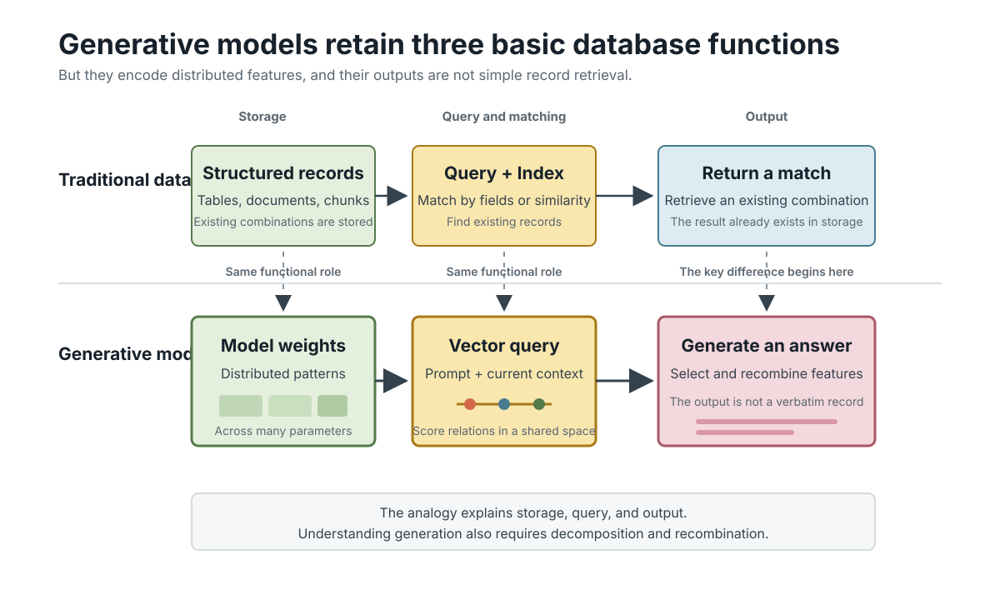
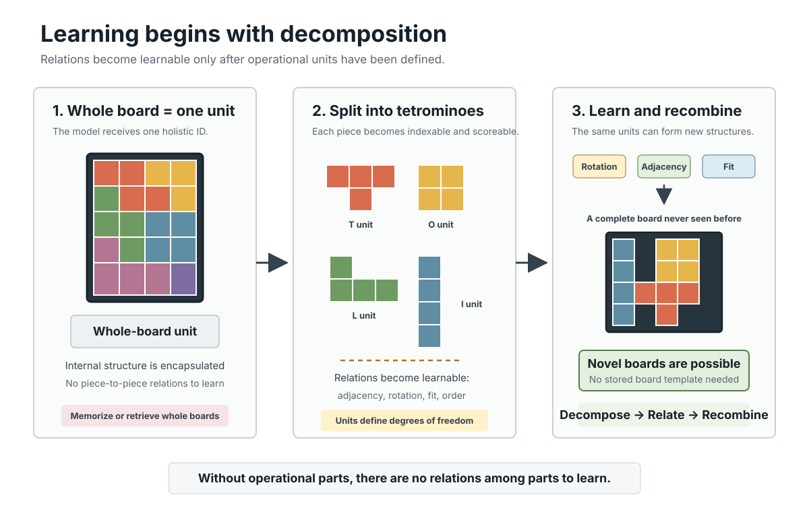
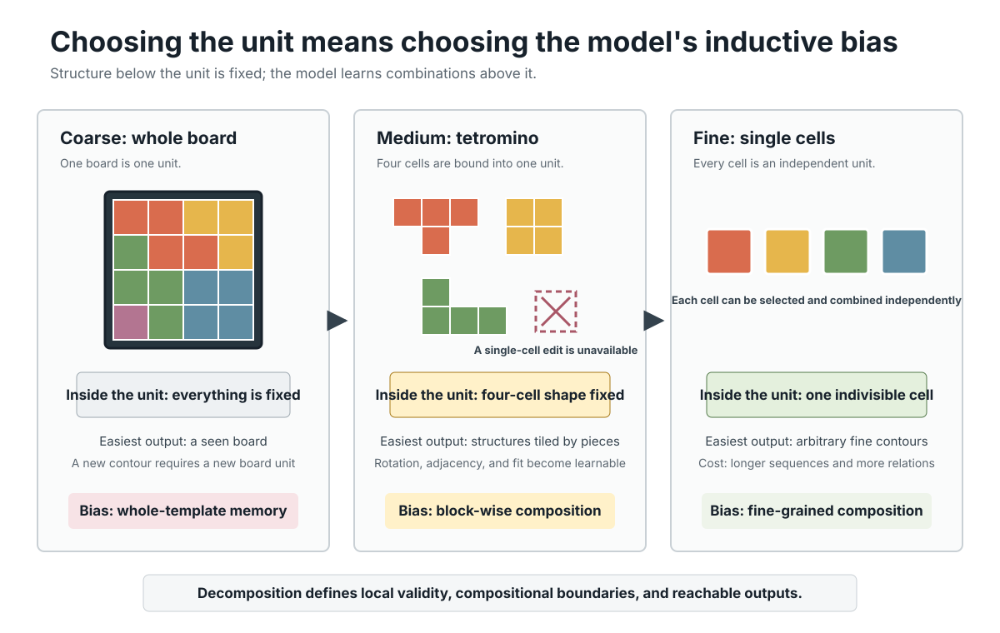

We often say that a generative model learns knowledge from data and stores that knowledge in its weights.

But this statement answers only one question: **where is the knowledge stored?**

Saying that knowledge is stored in weights is like saying that a database is stored on a hard drive. It identifies the storage medium, but tells us nothing about the schema. What are the records? What are the fields? What can be indexed, compared, and recombined?

For a generative model, the deeper question is:

> In what units must knowledge be organized so that the model can recombine it into something new?

The question becomes clearer through a database analogy.

## Why a Generative Model Resembles a Database

At a functional level, many generative systems can be described through three operations:

1. **Storage:** training creates a persistent internal knowledge structure.
2. **Query:** the current input is transformed into a representation that can interact with that structure.
3. **Output:** the system uses the resulting matches and relations to produce an answer.

A database has a similar functional organization:

1. Data is organized into tables, documents, or indexes.
2. A user submits a query, and the system applies a matching rule.
3. The system returns the corresponding result.

From this perspective, a generative model resembles a database. Its weights collectively provide long-term storage. In a conditional system, the prompt acts like a query. The model uses its learned internal structure to produce an output.



*Figure 1. Both databases and generative models have storage, query, and output functions.*

This analogy is functional, not literal. A model does not contain a clean table of sentences, images, or facts that we can inspect row by row. Its knowledge is distributed across parameters.

The value of the analogy is its starting point: generation requires an internal structure that can be queried.

But the analogy immediately leaves a gap.

A database can tell us exactly what counts as a record and which fields are indexed. When we say that a model "stores knowledge in its weights," what counts as a record inside the model?

Is it a sentence? A word? A character? A whole image? A patch? A pixel?

Without an answer, "storing knowledge" remains too vague to explain learning or generation.

## Storage Requires Decomposition

Matching and recombination require objects that can be matched and recombined.

If a representation treats an entire sample as one indivisible object, a model can recognize that object, assign it a score, or retrieve it later. But the representation exposes no independently manipulable parts and therefore no explicit relations among parts to learn.

This gives us a more fundamental principle:

> A representation must expose reusable parts before a model can learn how those parts form a whole.

Call each part a **unit**. A unit is more than a chunk created during preprocessing. It is the smallest object that the representation lets the model independently select, score, or combine.

In that sense:

> **Within this abstraction, each independently manipulable unit creates a degree of freedom.**

Tetris provides a clean visual model of this idea.

## What If an Entire Tetris Board Had Only One ID?

Imagine collecting many Tetris boards and training a model to generate new ones.

The coarsest possible representation would treat every complete board as one indivisible unit:

```text
Whole board A
Whole board B
Whole board C
```

The model could learn which complete boards occur frequently and select among them. But the representation would not expose the pieces, positions, or shapes inside a board. The model could not directly learn:

- how a piece can rotate;
- how two pieces can touch;
- which shape fits a particular gap;
- how the same pieces can form different boards.

Under this representation, producing an unseen board would require that entire board to exist as a new unit.

The limiting factor is not model capacity. The representation exposes no parts that the model can operate on.

Now change the representation. Instead of treating the whole board as one unit, decompose it into tetrominoes.

Once the pieces become independent units, new learnable relations appear: rotation, adjacency, fit, and placement order. The same pieces can be rearranged into a complete board that never appeared in the training set.



*Figure 2. Once the board is decomposed into operational pieces, relations among pieces become learnable.*

This is the direct connection between decomposability and learnability:

> Without operational parts, a representation exposes no relations among parts to learn. Generation then collapses toward memorizing and selecting complete samples.

Representation constrains generative freedom before training begins because the unit choice defines what the model can manipulate independently.

## Why Finer Is Not Always Better

If decomposition creates more freedom, it is tempting to keep decomposing until we reach the smallest possible unit.

But finer decomposition is not automatically better.

The same Tetris world can be represented at several resolutions.

### Whole Board as the Unit

All internal structure is fixed. The representation favors remembering and reusing complete templates but offers little freedom to modify them locally.

The sequence is short: one board requires one unit. The cost is an enormous unit vocabulary and very limited recombination.

### Tetromino as the Unit

The four-cell structure inside each piece is fixed, while relations among pieces become learnable.

The model is biased toward block-wise composition. It can learn rotation, position, and fit, but cannot independently modify one cell inside a tetromino.

### Individual Cell as the Unit

Every cell can be selected and combined independently. Local freedom is maximized, and the model can construct contours that are not restricted to standard tetromino shapes.

The cost is that a structure previously represented by one piece now requires four units. Valid piece shapes are no longer given for free; the model must learn them. Sequences become longer, and the number of relations that must be modeled increases.



*Figure 3. Whole-board, tetromino, and cell-level units favor different forms of learning and generation.*

Decomposition is therefore not a neutral preprocessing decision. It determines at least three things:

1. **Which structures are fixed in advance.**  
   Relations inside a unit are already packaged by the representation.

2. **Which relations can be learned.**  
   The model primarily learns how units co-occur, connect, and transform.

3. **Which outputs are easy or reachable.**  
   The combinations permitted by the units define the model's natural generation space.

This is how decomposition injects **inductive bias** before training even begins. By choosing the units, we tell the model what kind of world it is allowed to see.

## Tokens, Patches, and Pixels Answer the Same Question

Tokenization, patching, and pixel-level representation are often introduced as preprocessing choices that convert raw data into an acceptable input format.

The Tetris example reveals a deeper role:

> They define the basic building blocks that the representation exposes to the model.

Text can be decomposed into sentences, words, subwords, or characters.

- With sentences as units, the representation favors reusing complete expressions.
- With words as units, internal spelling is fixed and word-to-word relations dominate.
- With characters as units, the system can construct words freely, but must learn spelling and morphology across longer sequences.

Images can similarly be represented as whole images, patches, or pixels.

- A whole-image unit offers almost no internal generation freedom.
- Patch-level units emphasize relations among regions.
- Pixel-level units offer the finest local control, but create far longer and more complex relation structures.

Representation therefore determines the scale at which the model can observe, learn, and recombine the world.

## So What Does a Generative Model Store?

We can now give a more precise answer to the opening question.

If a generative model is viewed as a database, it does not store a set of finished knowledge objects that can be read out directly. A more useful abstraction is:

> The model's weights encode patterns over decomposed units and their relations, allowing those structures to be reorganized under new conditions.

The weights tell us where the learned structure resides. Decomposition determines what can be stored, matched, and recombined.

One is the storage medium. The other defines the operational interface of knowledge.

The central design choice is not how finely data can be decomposed, but which structures the representation fixes and which relations it leaves the model to learn. That choice sets the model's inductive bias, compositional freedom, and computational cost before training begins.
