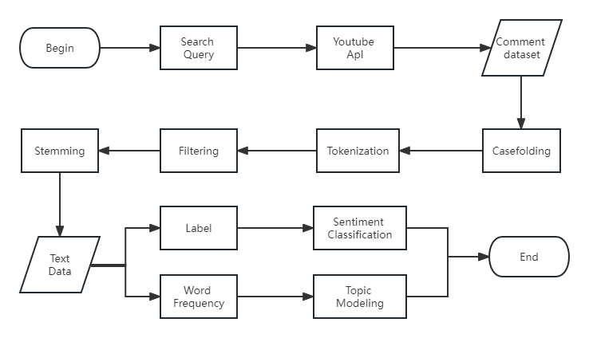
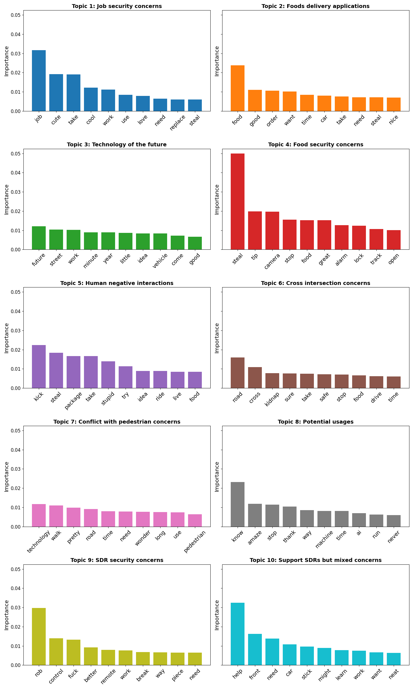

# Paper at a Glance

- Title: Understanding Social Perceptions, Interactions, and Safety Aspects of Sidewalk Delivery Robots Using Sentiment Analysis
- Authors: Yuchen Du, Tho V. Le
- Transportation Research Record
- Year: 2025
- DOI: https://doi.org/10.1177/03611981251394686

# Why This Study?
Sidewalk delivery robots (SDRs) are increasingly visible in urban environments, yet public acceptance remains uncertain.
Most existing studies rely on questionnaire-based surveys, which are often costly, slow, and limited in scale.
This work explores a different question:
 > What can large-scale, spontaneous social media discussions tell us about how people actually perceive delivery robots?

# What We Did (In One Sentence)

We analyzed nearly 5,000 YouTube comments using machine learning–based sentiment classification and topic modeling to uncover how people perceive, interact with, and worry about sidewalk delivery robots in real-world contexts.

Our research process involved several key steps:

1. **Data Collection**: Gathering YouTube comments from videos discussing sidewalk delivery robots.
2. **Preprocessing**: Cleaning and preparing the text data for analysis.
3. **Sentiment Analysis**: Applying machine learning models to classify comment sentiments.
4. **Topic Modeling**: Identifying recurring themes and discussions using NLP techniques.
5. **Visualization & Interpretation**: Analyzing results and deriving insights.


*Figure: Overview of the research methodology.*

# Key Insights
Rather than focusing only on model accuracy, this study reveals human-centered insights:

- Public sentiment is mixed: while many people are excited about automation and future urban logistics, a substantial portion express fear, distrust, or resistance.
- Job security and automation anxiety emerge as dominant themes, especially after COVID-19.
- Pedestrian safety and sidewalk conflicts are recurring concerns, particularly for vulnerable populations.
- Robot security and vandalism—including theft, tampering, and hacking—are widely discussed but often overlooked in policy debates.
- Public attitudes are not static: topic prevalence shifts over time and reacts to major societal events.
- These findings highlight that SDR deployment is not only a technical problem, but also a social and behavioral challenge.


*Figure: Distribution of keywords across the 10 identified topics from LDA topic modeling.*

# Why It Matters

This study demonstrates that social media data can complement traditional surveys by providing:

- Larger sample sizes
- Real-time and longitudinal insights
- Rich, unsolicited public opinions

The proposed framework can support:
- Policymakers designing regulations for shared urban spaces
- Cities evaluating public readiness for robotic delivery
- Researchers studying human–robot interaction at scale

# Resources & Links

- 📄 **Full Paper**: [Transportation Research Record](https://journals.sagepub.com/doi/abs/10.1177/03611981251394686)
- 💻 **Code Repository**: [GitHub - sdr-sentiment-analysis](https://github.com/dudusoar/sdr-sentiment-analysis)

# Citation

To cite this work in your research, please use the following BibTeX entry:

```bibtex
@article{du2025sdr,
  title     = {Understanding Social Perceptions, Interactions, and Safety Aspects of Sidewalk Delivery Robots Using Sentiment Analysis},
  author    = {Du, Yuchen and Le, Tho V.},
  journal   = {Transportation Research Record},
  year      = {2025},
  volume    = {2677},
  number    = {12},
  pages     = {145--156},
  doi       = {10.1177/03611981251394686},
  url       = {https://doi.org/10.1177/03611981251394686}
}
```

**APA Style**:
Du, Y., & Le, T. V. (2025). Understanding social perceptions, interactions, and safety aspects of sidewalk delivery robots using sentiment analysis. *Transportation Research Record, 2677*(12), 145-156. https://doi.org/10.1177/03611981251394686
