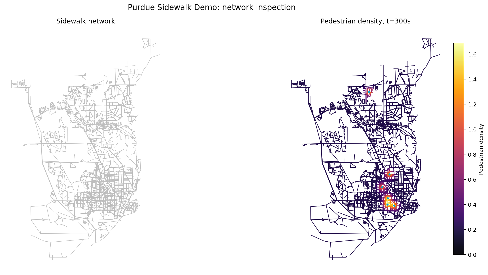
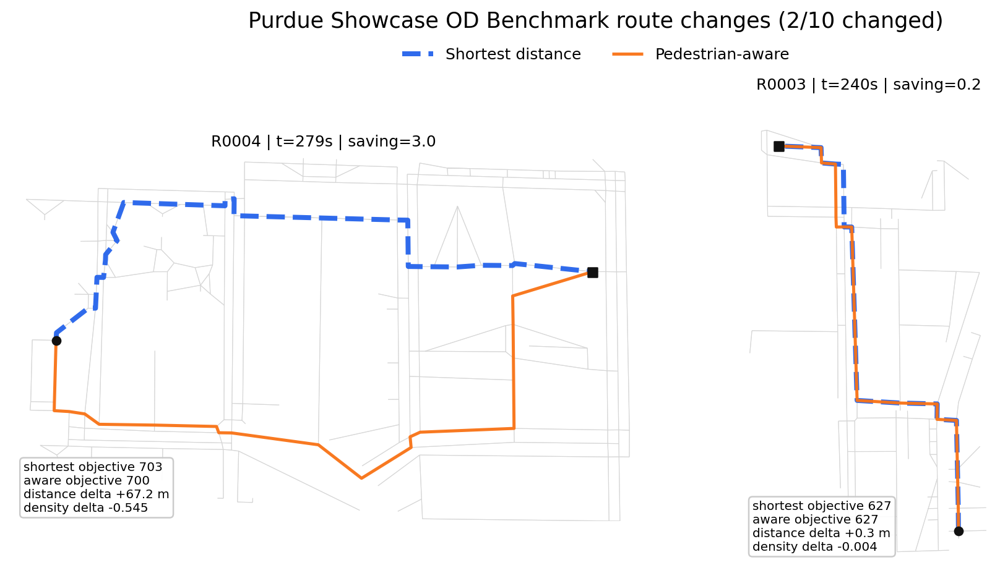
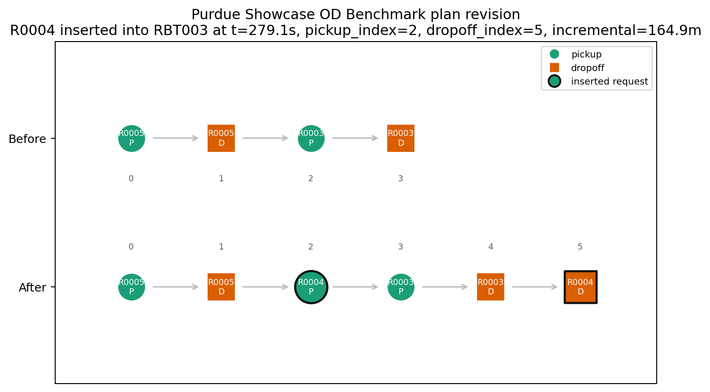
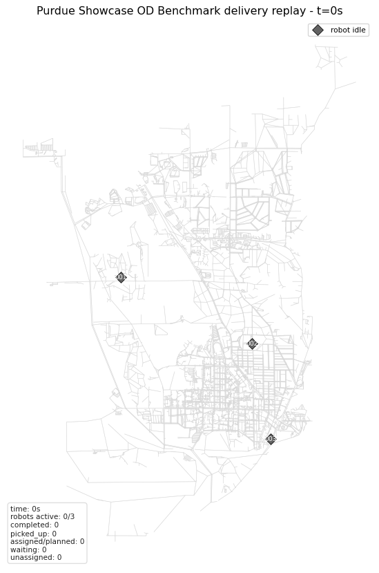

# Project at a Glance

- **Role**: research engineering lead and primary developer
- **Focus**: sidewalk delivery robot simulation, pedestrian-aware routing, dynamic dispatch, replay visualization
- **Stack**: Python, NetworkX, OpenStreetMap walk graphs, Matplotlib, JSON/CSV evidence exports
- **Repository**: [github.com/dudusoar/sdr-sidewalk-sim](https://github.com/dudusoar/sdr-sidewalk-sim)
- **Visualization update**: [replay showcase pull request](https://github.com/dudusoar/sdr-sidewalk-sim/pull/1)

`sdr-sidewalk-sim` is a research simulator for studying sidewalk delivery robot fleet control in pedestrian-aware urban environments. The project grew out of my dissertation work on sidewalk delivery robots, where the central question is not only how to route a robot, but how local pedestrian conditions change fleet-level dispatch and replanning decisions.

The simulator connects four layers:

1. sidewalk world modeling from walkable street graphs,
2. pedestrian-aware route cost and demand scenarios,
3. dynamic request visibility and dispatch decisions,
4. replayable outputs that make simulation behavior inspectable.

# Why I Built It

Most routing experiments collapse the environment into a static travel-time matrix. That is useful for benchmarking, but it hides the interaction that matters for sidewalk robots: a robot moves through pedestrian space, and that local condition can change what a good route or dispatch decision looks like.

The simulator is designed as a bridge between world modeling and fleet control. It keeps the core execution model simple enough to inspect, while exposing structured artifacts that can support heuristic solvers, learned dispatch policies, and future LLM-assisted controller experiments.

# What It Does

The current system supports:

- loading and caching OpenStreetMap `walk` graphs,
- generating node-based pickup and dropoff demand,
- comparing shortest-distance and pedestrian-aware route costs,
- simulating dynamic request release without future-order leakage,
- exposing solver-visible problem snapshots instead of private simulator state,
- recording request lifecycle events and robot trajectories,
- exporting replay-ready CSV, JSON, PNG, and GIF artifacts,
- validating trajectory, lifecycle, capacity, and timing consistency.

# Replay and Debugging

The newest visualization work focuses on making simulation behavior easier to audit. A dynamic dispatch result can now be inspected through plan-revision snapshots, robot timelines, trajectory replay plots, final-frame delivery views, and frame-state JSON exports for downstream UI work.

The replay layer samples executed trajectory segments over time, reconstructs robot and request state at each frame, and renders the result as either static frames or short animations.

# Engineering Notes

The project deliberately separates runtime execution from solver proposals:

- the simulator owns execution truth and lifecycle state,
- solvers receive explicit problem snapshots,
- replay code reads exported simulation results rather than private runtime objects,
- validation checks the exported artifacts instead of trusting summary metrics.

This boundary matters because it keeps later controller experiments honest. A dispatch policy can only act on the visible snapshot, while replay and validation can still reconstruct what actually happened.

# Current Status

The public repository has a compact showcase pipeline for generating the figures above. The replay visualization update is staged in a public pull request so the visual artifacts, frame-state export, and documentation changes can be reviewed together.

Next planned work is to use this simulator as a cleaner portfolio and dissertation asset: first as a readable research-engineering project, then as a controlled benchmark bed for comparing heuristic, learned, and LLM-assisted online dispatch controllers.
