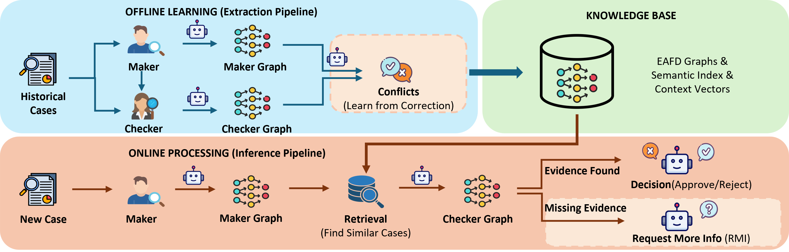
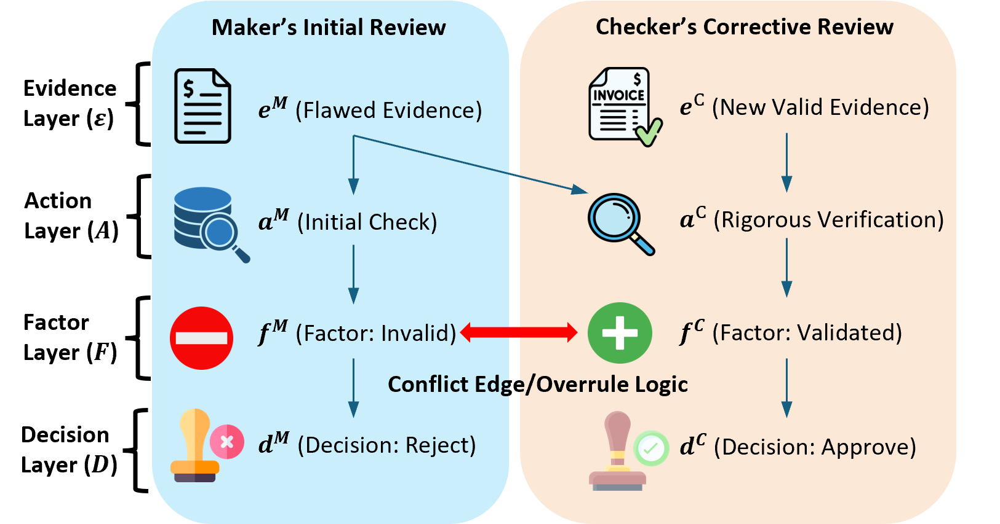
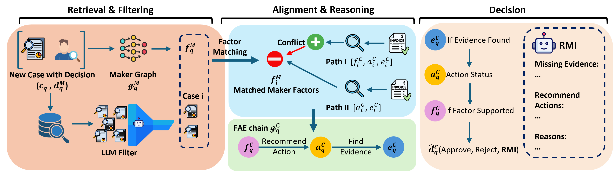

# Paper at a Glance

- **Title**: Reviewing the Reviewer: Graph-Enhanced LLMs for E-commerce Appeal Adjudication
- **Authors**: **Yuchen Du**, Ashley Li, Zixi Huang
- **Status**: arXiv preprint, 2026
- **arXiv**: [2603.19267](https://arxiv.org/abs/2603.19267)

**Current status:** this page now tracks the public arXiv preprint record only; earlier venue-status language has been removed.

*This research was conducted during Yuchen Du's internship at Amazon, in collaboration with Ashley Li and Zixi Huang.*

---

# Why This Study?

Large e-commerce platforms handle millions of seller appeals every year.

A seller gets flagged for a policy violation. They appeal. A first-tier reviewer — the **Maker** — examines the submitted evidence and makes a decision. A second-tier reviewer — the **Checker** — audits that decision. Sometimes, the Checker overturns it.

That overturn is the interesting part.

> **When a Checker overturns a Maker's decision, they are encoding exactly why the initial judgment was wrong.**

These correction events are rare, high-quality, and deeply informative. But they are hard to learn from — because the Checker often had access to information the Maker never saw: external verification tools, cross-case precedents, additional investigation steps.

This is the **information asymmetry** problem.

A standard LLM reading the same case file as the Maker will make the same mistakes. It cannot know what it does not know. It will hallucinate a confident answer where the right answer is "I need more information."

---

# What We Did (In One Sentence)

We built a **conflict-aware graph reasoning framework** that explicitly models the *verification actions* separating Maker and Checker reasoning — and learns from historical correction signals to adjudicate new cases.

---

# The Key Idea

## The EAFD Schema

The core contribution is a new representation for adjudication reasoning: the **Evidence–Action–Factor–Decision (EAFD)** graph.

Most approaches try to go directly from evidence to decision. We argue this is where hallucination enters — the model skips the reasoning steps that a human reviewer would actually perform.

The EAFD schema inserts two intermediate layers:

- **Evidence (E)**: atomic facts extracted from the case file — invoices, emails, complaint records
- **Action (A)**: the verification steps a reviewer actually performs — checking inventory records, contacting suppliers, querying external databases
- **Factor (F)**: the abstract judgment criteria derived from those actions — whether FIFO compliance was validated, whether supplier trust was established
- **Decision (D)**: the final adjudication outcome — Approve, Reject, or Request More Information

The Action layer is the key innovation. It grounds LLM reasoning in *verifiable operations* rather than unconstrained text generation. Without it, the model jumps from evidence directly to judgment — exactly the shortcut that produces hallucinations.

## Learning from Conflict

For each historical case where a Checker overturned a Maker, we construct two EAFD graphs — one for the Maker's reasoning, one for the Checker's — and explicitly model the **conflict edges** between them.

These conflict edges are the learning signal. They capture, structurally, what the Maker missed: which verification actions were skipped, which factors were misweighted, which evidence was overlooked.

The knowledge base aggregates thousands of such conflict-annotated graphs, forming a retrievable repository of adjudication precedents.

## Online Reasoning

At inference time, the system follows a four-phase pipeline:

1. **Retrieval**: find the most similar historical cases from the knowledge graph using embedding-based search
2. **Checker graph projection**: derive what the Checker's resolution path would look like for this new case
3. **Deductive inference**: reason top-down from Factor to Action to Evidence, validating each step
4. **Adjudication**: produce a final decision with full reasoning trace

A distinctive capability is the **Request More Information (RMI)** outcome. When the evidence is insufficient — when a required verification action has no corresponding evidence — the system does not force a premature decision. Instead, it identifies precisely which actions remain unexecuted and generates targeted information requests for the seller.

This "knowing what you don't know" capability is one of the most practically valuable features for real-world deployment.

---

# What We Found

| System | Alignment with Human Experts |
|--------|------------------------------|
| LLM-only baseline | 70.8% |
| + Action modeling with RMI | 87.5% |
| + Retrieval-based knowledge graph | 95.8% (offline) |
| **Production deployment** | **96.3%** |

The jump from 70.8% to 87.5% comes entirely from introducing the Action layer — before any retrieval or knowledge graph. This isolates the contribution of action modeling and confirms that information asymmetry is the core problem.

Adding the knowledge graph pushes performance further, as the system can now leverage verified resolution paths from similar historical cases rather than reasoning from scratch.

In production, the framework maintains 96.3% alignment with human Checker decisions — demonstrating that the offline gains transfer to real-world deployment.

---

# Why It Matters

This work sits at the intersection of:

- LLM reasoning and hallucination prevention,
- knowledge graph construction from human correction signals,
- industrial deployment of AI in high-stakes decision workflows.

The EAFD framework is not specific to e-commerce. Any domain with hierarchical human review generates the same kind of correction signals: legal appeals, medical second opinions, financial compliance audits. The same approach applies wherever a second reviewer's overturn encodes structured knowledge about why the first reviewer was wrong.

---

# Resources & Links

- 📄 **arXiv**: [arXiv:2603.19267](https://arxiv.org/abs/2603.19267)
- 📄 **Status**: arXiv preprint, 2026

---
