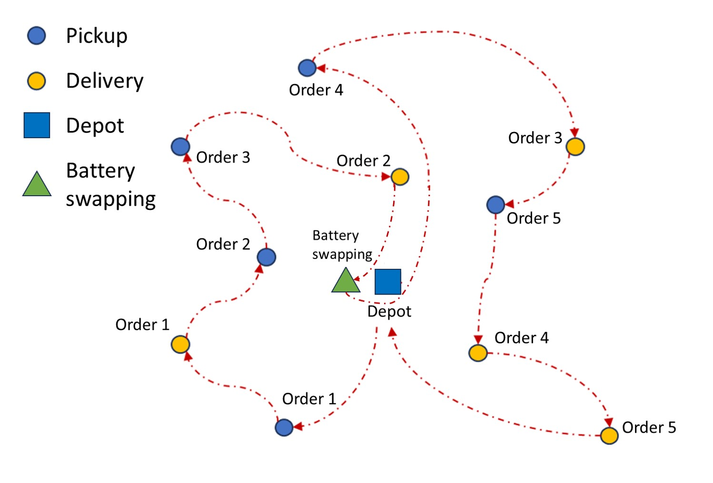
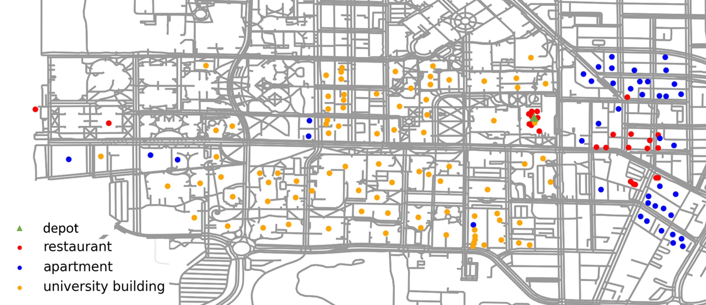

# Paper at a Glance

- **Title**: Two-stage stochastic fleet and battery sizing with routing optimization for sidewalk delivery robots
- **Authors**: **Yuchen Du**, **Hai Yang**, Joseph Y. J. Chow, Tho V. Le
- **Journal**: Transportation Research Part E
- **Year**: 2025
- **DOI**: https://doi.org/10.1016/j.tre.2025.104220

*This research was primarily conducted by **Yuchen Du** and **Hai Yang**, with significant contributions from Joseph Y. J. Chow and Tho V. Le.*

---

# Why This Study?

Sidewalk delivery robots (SDRs) are no longer futuristic prototypes — they are already delivering food and groceries on campuses and in dense urban areas.

But a practical question remains surprisingly hard to answer:

> **How many robots — and how many batteries — does an operator actually need?**

This is not just a routing problem.

- Demand is uncertain.
- Robots have limited battery range.
- Charging is slow, so battery swapping becomes attractive.
- Over-provisioning is expensive; under-provisioning causes delays and poor service.

Most existing studies focus on *operational routing* **given** a fleet size.  
We instead ask a more strategic question:

> **How should an SDR system be designed *before* demand is realized?**

---

# What We Did (In One Sentence)

We developed a **two-stage stochastic optimization framework** that jointly decides **fleet size and battery provisioning**, while explicitly accounting for **routing decisions under uncertain demand**.

---

## The Key Idea

The challenge is scale.

- Solving routing problems for *every possible demand scenario* is computationally infeasible.
- Classical stochastic programming (e.g., SAA) quickly becomes too slow.

Our solution combines **two complementary views**:

1. **Detailed routing intelligence**
   A customized pickup–delivery routing heuristic with:
   - soft time windows,
   - battery consumption,
   - depot-based battery swapping.

   

2. **Analytical system-level approximation**  
   A continuous approximation model that captures *average routing behavior* without simulating every detail.

Together, they form a **fast and scalable decision framework**.


---

# Why Battery Swapping?

For sidewalk robots, charging is not always practical during operation.

Battery swapping offers:
- fast turnaround,
- predictable energy recovery,
- simpler operational logic.

But swapping changes routing behavior and resource needs.

Our model explicitly captures:
- *when* robots need to swap,
- *how many* spare batteries are required,
- *how swapping interacts with fleet size*.


---

# What We Found

Across synthetic experiments and a real-world campus case study:



- The **optimal fleet size is not monotonic** with demand.
- Adding robots and adding batteries are *substitutable but not equivalent*.
- Continuous approximation provides **near-identical decisions** to classic stochastic programming — at a fraction of the computational cost.
- The framework scales to realistic demand levels where exact methods fail.

---

# Why It Matters

This work sits at the intersection of:

- urban logistics,
- stochastic optimization,
- autonomous delivery systems.

It shows that:
- strategic design decisions cannot be separated from routing logic,
- approximation models can meaningfully guide real-world system design,
- SDR systems can be analyzed using tools that bridge theory and practice.

The framework is generalizable to:
- other electric delivery platforms,
- different charging or swapping policies,
- campus-scale or neighborhood-scale deployments.

---

# Resources & Links

- 📄 **Full Paper**: https://doi.org/10.1016/j.tre.2025.104220
- 💻 **Code Repository**: https://github.com/dudusoar/VRP-Toolkit

---

# Citation

```bibtex
@article{du2025two,
  title   = {Two-stage stochastic fleet and battery sizing with routing optimization for sidewalk delivery robots},
  author  = {Du, Yuchen and Yang, Hai and Chow, Joseph Y. J. and Le, Tho V.},
  journal = {Transportation Research Part E},
  volume  = {201},
  pages   = {104220},
  year    = {2025}
}
